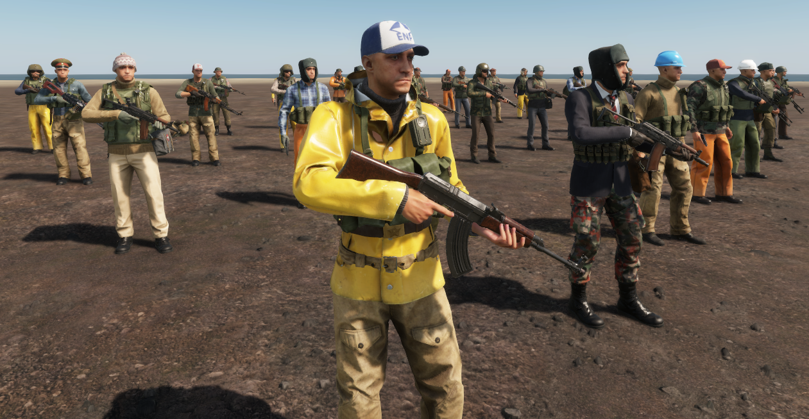

# Randomized Loadout Manager

## About
Provides a drop-in replacement for the vanilla `BaseLoadoutManagerComponent` that enables full variant randomization of every loadout slot (+ weapons and loot!), allowing you to create thousands of uniquely kitted characters from a single character prefab. Great for randomizing player spawn loadouts in FFA game modes or implementing Scav-like NPCs.

Originally created to implement Scavs in my FFA PvPvE game mode [MercOut!](https://reforger.armaplatform.com/workshop/64C4F3E0169E5739-MercOut), refactored to be more general-purpose and released standalone to give something back to the modding community 🙂

### Automatic arsenal randomization
Uses [DynamicLoot](https://reforger.armaplatform.com/workshop/66B2F0B008DC590F-DynamicLoot) to read and evaluate arsenal items from every faction's EntityCatalogs, this means chracter prefabs
set up to use it will automatically get any gear (vanilla or modded, as long as it's available in EntityCatalogs) added to their "loot tables" with item rarity based on arsenal supply cost.

This currently only works out of the box for vanilla loadout slots, modded slots will need to be [manually configured](#randomizing-new-slot-types--setting-fallback-variants) until a future update adds support for detecting them automatically.

## Setup
See `WYQ_TestWorld.ent` and/or `Randomized_Character_Base.et` for an example.

### Creating a new randomized character prefab
You can set up any character prefab to have randomized loadout slots, both AIs/NPCs and players can be given fully randomized gear:

 - Replace `BaseLoadoutManagerComponent` with `WYQ_RandomizedLoadoutManagerComponent` in your prefab's components.
 - Populate loadout slots with placeholder item prefabs (examples in `Prefabs/Characters/WYQ_RandomizedLoadoutManager`).
 - Populate primary `CharacterWeaponSlotComponent` with placeholder weapon prefab (variants can include secondary slot weapons i.e. handguns and they should get equipped correctly, this is just somewhere to set the placeholder prefab).

### Randomizing new slot types
You can enable randomization of non-vanilla loadout slot types (such as those from Zelik's Character) by creating your own randomized slot item prefab with an editable entity variants list.

 - Duplicate a prefab already set up to work with the desired slot e.g. sunglasses prefab -> `Eyewear_Randomized.et`
 - Add `SCR_EditableEntityComponent` to the duplicated prefab, configure randomization by adding variants
 - Add your new randomized item prefab to the relevant loadout slot in `WYQ_RandomizedLoadoutManagerComponent` e.g. under `Eyewear`

### Variant randomization
You can create characters with specific subsets of gear and loot by configuring the `SCR_EditableEntityComponent` on the prefab in your slot(s) to specify randomized variants. This allows you to create uniquely geared characters e.g. bosses with better than average weapons and armour while still having a degree of randomization.

Any slots with randomized variants configured will select items from those specified variants instead of from DynamicLoot's unified EntityCatalogs.

## License
APL - https://www.bohemia.net/community/licenses/arma-public-license